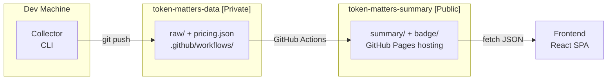

# Token Matters


Personal AI token usage tracker and dashboard. Monitor your token consumption and costs across Claude Code, GLM Coding, TRAE Pro, and more.

**Live Dashboard**: [newbdez33.github.io/token-matters](https://newbdez33.github.io/token-matters/)

## Architecture



**Three repositories**:

| Repository | Visibility | Contents |
|------------|:----------:|----------|
| [`token-matters`](https://github.com/newbdez33/token-matters) | Public | Collector CLI + Summary aggregation + Frontend |
| [`token-matters-data`](https://github.com/newbdez33/token-matters-data) | Private | Raw collection data + pricing.json + GitHub Actions workflow |
| [`token-matters-summary`](https://github.com/newbdez33/token-matters-summary) | Public | Aggregated summary JSON + SVG badges (GitHub Pages hosted) |

**Data flow**:

1. **Collect**: Collector CLI runs on a schedule on dev machines, collects token data from each provider, and pushes to `token-matters-data/raw/`
2. **Aggregate**: GitHub Actions in `token-matters-data` triggers on `raw/**` push (also every 6 hours / manual), runs the summary aggregation pipeline
3. **Publish**: The action pushes generated summary JSON + badge SVGs to `token-matters-summary`, where GitHub Pages auto-deploys
4. **Display**: Frontend fetches aggregated JSON from GitHub Pages and renders charts

## Supported Providers

| Provider | Billing | Data Quality | Collection Method |
|----------|:-------:|:------------:|-------------------|
| Claude Code (Anthropic) | Token | exact | Local JSONL parsing |
| Codex CLI (OpenAI) | Token | exact | Local JSONL parsing |
| OpenCode | Token | exact | Local SQLite query |
| GLM Coding (Zhipu AI) | Subscription | partial | Monitoring API |
| TRAE Pro (ByteDance) | Subscription | estimated | Local log parsing + token estimation |

## Collector Configuration

Config file: `~/.token-matters/config.yaml`

```yaml
dataRepo: ~/projects/token-matters-data
timezone: Asia/Shanghai

providers:
  claude-code:
    enabled: true
    claudeDir: ~/.claude          # optional, defaults to ~/.claude

  codex:
    enabled: true
    codexDir: ~/.codex            # optional, defaults to ~/.codex (or $CODEX_HOME)

  opencode:
    enabled: true
    openCodeDir: ~/.local/share/opencode  # optional, defaults to $XDG_DATA_HOME/opencode

  glm-coding:
    enabled: true
    apiKey: your-api-key
    baseUrl: https://open.bigmodel.cn     # optional

  trae-pro:
    enabled: true
    traeDir: ~/Library/Application Support/Trae  # optional, auto-detected per platform
```

Set `enabled: false` to disable a provider. Providers not listed in config are enabled by default.

```bash
cd collector
pnpm collect --status       # show provider status
pnpm collect                # collect today's data
pnpm collect --date 2026-02-20          # collect for a specific date
pnpm collect --from 2026-02-01 --to 2026-02-20  # collect a date range
pnpm collect --dry-run      # preview without writing
```

## Frontend

React SPA dashboard that reads summary JSON from GitHub Pages.

| Page | Path | Description |
|------|------|-------------|
| Dashboard | `/` | Token totals, costs, provider breakdown, daily trend |
| Provider | `/providers/:id` | Single provider detail, token breakdown, trends |
| Analytics | `/analytics` | Browse historical data by day/week/month |
| Settings | `/settings` | Theme toggle, cache management, data export |

```bash
cd frontend
pnpm install
pnpm dev        # local dev at http://localhost:5173/token-matters/
pnpm build      # production build
pnpm test       # run tests
```

## Tech Stack

| | Choice |
|--|--------|
| Runtime | TypeScript / Node.js |
| Frontend | React 19 + Vite + Tailwind CSS 4 + shadcn/ui + Recharts |
| State | Zustand + Dexie.js (IndexedDB cache) |
| CI/CD | GitHub Actions |
| Hosting | GitHub Pages |

## Documentation

| Document | Contents |
|----------|----------|
| [`architecture.md`](docs/architecture.md) | Dual-repo architecture, data store design, data flow, dedup strategy, ADRs |
| [`collector.md`](docs/collector.md) | Collector structure, provider interface, collection pipeline, config |
| [`backend.md`](docs/backend.md) | Summary aggregation pipeline, SVG badges, Phase 2 backend roadmap |
| [`frontend.md`](docs/frontend.md) | Feature requirements, tech stack, UI visual design system |
| [`data-integration.md`](docs/data-integration.md) | Per-provider technical details, API docs, POC results |
| [`collector-doctor-init.md`](docs/collector-doctor-init.md) | Collector --doctor diagnostics + --init interactive setup |
| [`plan.md`](docs/plan.md) | Implementation roadmap (Phase 1-7, including multi-user system) |

## License

MIT
